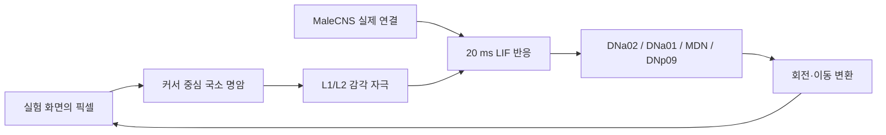

# Fly / Cursor Lab

실제 MaleCNS 신경 연결 데이터로 **브라우저 안의 초파리 가상 커서**를 움직이는 로컬 실험입니다. 독립적인 실험 화면과 Chrome 확장 프로그램을 제공합니다. 신경 계산은 로컬 CPU에서 실행합니다.

## 실행

Chrome의 다른 웹사이트에 붙이려면 [Chrome 확장 설치 안내](extension/README.md)를 따르세요. `extension` 폴더를 압축해제 확장으로 로드하고 현재 탭에서 켜면 됩니다. 기존 웹 실험과 같은 로컬 신경 서버를 사용합니다.

저장소를 내려받은 후 프로젝트 루트에서 실행하세요. Python 3.12 이상이 필요합니다. macOS에서 검증했으며 다른 운영체제의 실제 브라우저 동작은 아직 검증하지 않았습니다. Chrome 확장은 버전 116 이상을 대상으로 합니다. Node.js 22 이상은 JavaScript 테스트에만 필요합니다.

```sh
python3 -m venv .venv
.venv/bin/python -m pip install -r requirements.txt
.venv/bin/python prepare.py
.venv/bin/python server.py
```

[실험 열기](http://127.0.0.1:8765) → **실험 시작**. Esc로 정지합니다. 서버는 localhost에만 바인딩합니다. 확장과 실험실은 같은 모델을 공유하므로 하나만 실행하세요.

공식 원본 다운로드는 약 1.1 GB이며 데이터와 생성 그래프는 Git에서 제외됩니다. 준비 단계는 수 GB의 메모리를 사용할 수 있습니다. 원본 URL과 SHA-256은 `build/manifest.json`에 기록됩니다. 체크섬은 내려받은 파일을 식별하기 위한 것이며 별도 공식 체크섬과 대조한 것은 아닙니다.

## 사용할 수 있는 기능

- 실제 그래프: Traced 비신경교세포 뉴런 165,122개, 필터링 후 부호 있는 연결 10,228,000개.
- 빛의 섬 / 줄무늬 / 균일 화면. 화면 클릭으로 국소 빛 자극 배치.
- 국소 시각 입력 미리보기, 운동 뉴런별 발화율, 활성 뉴런 수, 연산 시간.
- 시작 / 정지 / 초기화, 궤적, Esc 정지, 탭을 숨기면 정지.
- 시각 입력 차단 대조 실험: 다음 계산 구간에서 신경 출력과 이동이 0이 됨.

## 데이터에서 커서까지



화면 300×210 px를 64×40 명암 입력으로 줄여, annotation의 시각 column 좌표를 가진 L1/L2 뉴런 3,534개에 매핑합니다. column 수와 뉴런 수는 다릅니다. 실험실은 초파리 그림과 궤적을 감각 입력에 그리지 않습니다. 확장은 오버레이를 포함해 캡처한 뒤 해당 영역을 나머지 시야의 평균 명암으로 대체합니다. 가려진 실제 픽셀을 복원하는 것은 아닙니다.

시냅스 수 ≥ 3인 연결을 유지하고, 전달물질 예측으로 흥분/억제 부호를 부여합니다. 빠른 전달 모델에서 unknown 및 조절성 전달물질의 연결은 제외합니다. 시냅스 하나의 막전위 효과는 0.275 mV, resting/reset −52 mV, threshold −45 mV, 시간 상수 20 ms, 계산 간격 0.2 ms입니다. 이 값들과 입력 매핑은 모델 가정이며 연결 지도 자체의 측정값이 아닙니다.

각 화면 입력마다 **막전위를 초기화한 20 ms 반응 실험**을 합니다. 난수 생성기 상태는 이어가고 초기화 버튼에서 seed 42로 재설정합니다. 초기 연속 상태 실험에서 운동 출력이 소실되어, 이 버전에서는 연속 뇌 동역학이나 기억을 주장하지 않습니다. 완전한 생물학적 뇌/비행 시뮬레이터가 아닙니다.

커서 변환은 사람이 정한 규칙입니다:

- 회전 = clip((오른쪽 DNa02 Hz − 왼쪽 DNa02 Hz) / 450) × 0.65 rad / 응답.
- 전후 이동 = clip((DNa01 평균 Hz − MDN 평균 Hz) / 450) × (1 − clip(DNp09 평균 Hz / 450)) × 90 px / 응답.
- clip 범위는 회전·전후 입력 −1에서 1, 정지 입력 0에서 1입니다.
- 화면 경계 반사, 날갯짓, 렌더링 보간은 UI 규칙입니다. 임의 경로·빛에 끌리는 힘·자동 목표 추적을 추가하지 않습니다.

따라서 빛을 놓아도 접근이 보장되지 않고 멈춤·후진·회전이 나타날 수 있습니다. 명암 0인 화면은 L2에 자극을 주므로, 균일한 검은 화면과 입력 차단은 다른 실험입니다. 입력 자극은 Poisson 확률 과정이지만 커서에 별도 random walk를 더하지 않습니다.

브라우저 렌더링은 부드럽게 보간하지만 신경 계산은 CPU에서 수행되며 실시간 뇌 속도를 보장하지 않습니다. 실제 응답 속도는 우측 연산 시간에서 확인합니다. 수익률·학습·코인 판단 기능은 아직 없습니다.

## 검증

```sh
.venv/bin/python -m unittest discover -s tests -v
node --test tests/extension.test.cjs
node --check web/app.js
```

데이터 준비 전에는 신경 모델 통합 테스트만 건너뛰고 서버/API 테스트를 실행합니다. `prepare.py` 실행 후에는 실제 데이터의 그래프 크기, 운동 그룹 존재, 같은 seed와 시각 입력의 재현성, 자극에 의한 운동 출력, 입력 차단 시 0 출력을 검사합니다. 생물학적 정확성을 검증하는 테스트는 아닙니다.

## 파일

- `prepare.py`: 공식 데이터 다운로드, 출처 기록, sparse graph 구성.
- `brain.py`: 신경 반응 모델과 운동 출력.
- `server.py`: localhost API와 화면 제공.
- `web/`: Canvas 실험 화면과 초파리 렌더러.
- `extension/`: Manifest V3 Chrome 확장.
- `tests/`: 실제 신경 데이터 통합 테스트, HTTP API 테스트, Chrome API 모의 테스트.
- `scripts/package_extension.py`: 설치용 ZIP 생성.

## 확장 패키지 만들기

```sh
python3 scripts/package_extension.py
```

생성되는 `dist/fly-cursor-extension.zip`은 Git에서 제외됩니다. 설치할 때는 압축을 풀고 `extension` 폴더를 Chrome에 로드합니다. 확장을 수정한 뒤에는 Chrome 확장 관리 화면과 대상 웹페이지를 모두 새로고침하세요.

## 문제 해결

- 그래프 파일이 없으면 `python prepare.py`를 가상환경에서 먼저 실행합니다.
- 포트 8765가 사용 중이면 이전 서버를 종료한 뒤 다시 실행합니다.
- 확장에서 연결 오류가 발생하면 서버 실행 상태와 [확장 설치 안내](extension/README.md)를 확인합니다.
- 캡처 및 Chrome 권한의 실제 동작은 모의 테스트만으로 보장되지 않습니다. 설치 후 대상 사이트에서 확인하세요.

## 출처와 표시

- [MaleCNS 공식 다운로드](https://male-cns.janelia.org/download/): 데이터 © HHMI Janelia FlyEM, University of Cambridge, MRC LMB, Google Research. CC-BY; 공식 페이지의 라이선스 링크를 따릅니다. 본 프로젝트는 연결 필터링, 전달물질 부호 매핑 및 시뮬레이션 변환을 적용했습니다.
- [Google Research 소개](https://research.google/blog/a-connectomics-milestone-mapping-the-complete-male-fruit-fly-brain/).
- [Shiu et al., Nature 2024](https://www.nature.com/articles/s41586-024-07763-9): 단순화한 connectome 기반 LIF 접근의 참고 연구. 원 논문의 실험 결과가 본 커서 모델에 검증된 것은 아닙니다.
- [flycoinrh](https://github.com/fruitflydev/flycoinrh): 감각/운동 연결 방식의 코드 참고. 저장소를 복제하거나 거래 실행 코드를 사용하지 않았습니다.
- [awesome-fly](https://github.com/cobanov/awesome-fly): 프로젝트 탐색 참고.

연구기관 및 참고 프로젝트와 제휴 관계가 없습니다.

## 라이선스

프로젝트 코드는 [MIT License](LICENSE)로 배포합니다. MaleCNS 데이터는 별도의 CC-BY 조건을 따르며 저장소에 포함하지 않습니다. 참고 구현과 데이터에 대한 표시는 [THIRD_PARTY_NOTICES.md](THIRD_PARTY_NOTICES.md)를 참고하세요.
